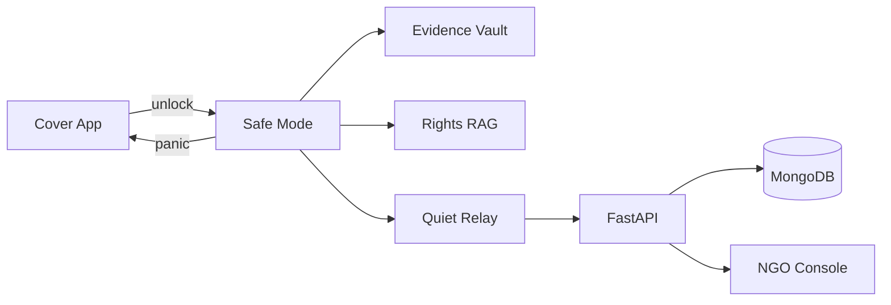

# Safra

### *Help that doesn’t look like help.*

**Rush Hour Hackathon** · Team **Grand Theft Algorithm**  
**GitHub:** [M-P-Sanjev/Grand-Theft-Algorithm](https://github.com/M-P-Sanjev/Grand-Theft-Algorithm)

Safra is a discreet safety platform for survivors in monitored or abusive environments. It hides behind an ordinary **Recipes / Shopping List** cover app, privately stores evidence, answers rights questions with cited RAG, and alerts a **verified NGO** — without looking like a safety app.

> The most dangerous moment isn’t the abuse — it’s being caught asking for help.  
> Safra is built for that moment.

---

## 1. Project title and team details

| Field | Details |
|-------|---------|
| **Project** | Safra |
| **Tagline** | Help that doesn’t look like help |
| **Hackathon** | Rush Hour |
| **Team** | Grand Theft Algorithm |
| **Repo** | Grand-Theft-Algorithm |

| Name | Role |
|------|------|
| *(add member)* | |
| *(add member)* | |
| *(add member)* | |
| *(add member)* | |
| *(add member)* | |

---

## 2. Problem statement and solution

### Problem
About **1 in 3 women** face physical or sexual violence globally; ~**30% in India** report domestic violence (WHO / NFHS). Abusers often control phones, read chats, and check installed apps. Opening a visible SOS or “women safety” app can escalate harm.

Survivors often cannot:
- call helplines openly  
- keep a visible safety app installed  
- ask legal questions without being overheard  
- send evidence without creating an obvious digital trail  

### Solution
Safra is **safety infrastructure**, not another chatbot:

| Layer | What it does |
|-------|----------------|
| **Cover Mode** | App looks like recipes / kirana list |
| **Quiet Relay** | “Share recipe” secretly sends a structured NGO alert |
| **Clarity Tools** | Camera evidence vault + Rights RAG + silent Calm Cards |

This core (cover → private vault → trusted relay → human console) can later expand to other discreet document / reminder flows **without changing the product spine**.

---

## 3. Features

- **Cover Mode** — decoy recipe/shopping UI  
- **Safe Mode** — secret unlock (PIN / pattern / gesture)  
- **Panic exit** — instant return to cover  
- **Duress PIN** — opens decoy only; vault stays locked  
- **Evidence Vault** — camera photos + notes, share only when chosen  
- **Quiet Relay** — mundane “share recipe” → NGO alert  
- **Rights Guide (RAG)** — cited answers + “not legal advice” + helpline  
- **Calm Cards** — silent text grounding (no loud TTS by default)  
- **NGO Console** — human triage + ML severity *suggestion*  

---

## 4. Complete tech stack

| Layer | Technology |
|-------|------------|
| Frontend | Next.js, TypeScript, Tailwind CSS |
| Backend | Python 3.12, FastAPI, Pydantic |
| Database | MongoDB Atlas |
| Auth (NGO) | Secure staff auth for console access |
| AI / ML | LLM + embeddings, RAG, severity assist |
| Storage | Local vault (device) + MongoDB (alerts/cases) |
| Deploy | Vercel (frontend), Render (backend) |

**Hardware:** None for MVP (software-first).

---

## 5. System architecture diagram

```text
┌──────────────────────────┐
│  Survivor phone (Cover)  │
│  Recipes / Shopping UI   │
└────────────┬─────────────┘
             │ secret unlock
             v
┌──────────────────────────┐
│        Safe Mode         │
│  Vault │ RAG │ Calm Card │
│     Quiet Relay share    │
└────────────┬─────────────┘
             │ structured alert
             v
┌──────────────────────────┐
│     FastAPI + MongoDB    │
│  alerts · RAG · severity │
└────────────┬─────────────┘
             │
             v
┌──────────────────────────┐
│      NGO Console         │
│  human triage + actions  │
└──────────────────────────┘
```



---

## 6. Detailed workflow

### Survivor workflow
1. Opens Safra → sees normal recipes  
2. Secret unlock → Safe Mode  
3. Adds note and/or photo to vault  
4. Taps **Share recipe** (Quiet Relay)  
5. Optionally asks Rights Guide  
6. Hits **Panic** → back to cover  

### NGO workflow
1. Alert appears in console  
2. Review ML severity suggestion  
3. Human confirms / assigns / follows protocol  
4. Update case status  

### Quiet Relay (why not public stego)
Public image steganography often breaks on WhatsApp/IG compression and needs unrealistic “hashtag scraping.”  
Safra sends a **structured alert to a verified NGO channel**, while the UI action still looks mundane.

---

## 7. Folder structure

```text
Grand-Theft-Algorithm/
├── README.md
├── frontend/                 # Next.js — Cover, Safe Mode, NGO console
│   ├── package.json
│   ├── src/
│   └── public/
├── backend/                  # FastAPI
│   ├── main.py
│   ├── requirements.txt
│   ├── routes/
│   ├── services/             # RAG, severity, alerts
│   └── data/                 # curated rights corpus (sample)
├── docs/                     # extra diagrams / notes
└── .env.example
```

---

## 8. Installation and usage guide

### Prerequisites
- Node.js 18+  
- Python 3.12+  
- MongoDB Atlas (or local MongoDB)  
- LLM + embeddings API keys  

### Backend
```bash
cd backend
python -m venv .venv
.\.venv\Scripts\activate          # Windows
# source .venv/bin/activate       # macOS/Linux
pip install -r requirements.txt
cp .env.example .env
uvicorn main:app --reload
```
API docs: `http://127.0.0.1:8000/docs`

### Frontend
```bash
cd frontend
npm install
cp .env.example .env.local
npm run dev
```
App: `http://localhost:3000`

### Usage (demo path)
1. Browse Cover Mode recipes  
2. Unlock Safe Mode  
3. Save note/photo → Share recipe  
4. Open NGO Console to see alert  
5. Panic to return to cover  

---

## 9. API / Database documentation

### API (planned / MVP)

| Method | Route | Purpose |
|--------|-------|---------|
| POST | `/alerts` | Create structured survivor alert |
| GET | `/alerts` | NGO alert queue (authorized) |
| PATCH | `/alerts/{id}` | Update status / assignment |
| POST | `/rag/ask` | Rights Guide Q → cited answer |
| POST | `/severity/suggest` | ML severity suggestion |
| POST | `/vault/share` | Explicit evidence attach/share |

### Database (MongoDB)

| Collection | Purpose |
|------------|---------|
| `alerts` | Incoming Quiet Relay cases |
| `responders` | NGO staff profiles |
| `rights_chunks` | Embedded legal/helpline text for RAG |
| `sessions` *(optional, consent)* | Minimal Safe Mode context |

---

## 10. AI / ML workflow

```text
Rights PDFs / helpline FAQs
        │
        ▼
  chunk + embed ──► MongoDB vector store
        │
User question ──► embed query ──► retrieve top-k
        │
        ▼
   LLM answer + citations + helpline CTA
   (+ disclaimer: not legal advice)
```

**Also used:**
- LLM expands short distress notes into clear structured alert text  
- ML suggests Low / Medium / High severity — **human confirms**  

**Not in MVP:** 3D therapy avatars, public social stego decoding, perpetrator lookalike matching.

---

## 11. Hardware components

**Not applicable for MVP** — Safra is software-first (no circuit / wiring).  
Future optional: discreet wearable panic (out of scope for Rush Hour build).

---

## 12. Security measures

- Cover UI + panic exit + duress PIN (discovery resistance)  
- Explicit share only (no auto-post to social)  
- Least data to server by default  
- NGO routes authenticated  
- Vault treated as sensitive; encrypt at rest where feasible  
- Clear product boundaries: info tool ≠ lawyer / clinician / guaranteed rescue  
- Partner NGO model before any “authorities will arrive” claim  

---

## 13. Testing and performance

| Area | Approach |
|------|----------|
| Cover / Safe / Panic UX | Manual demo checklist every build |
| Alert pipeline | Create alert → appears in NGO queue |
| RAG | Golden questions with expected citation presence |
| Severity | Spot-check labels vs human judgment |
| Performance | Target <3s alert create; RAG answer under ~8s on demo wifi |

Automated tests will be added as modules land (`pytest` backend, frontend smoke checks).

---

## 14. Challenges faced and future scope

### Challenges
- Balancing **real safety** vs hackathon spectacle  
- Avoiding fragile public steganography channels  
- Keeping AI helpful without overclaiming legal/medical authority  
- Designing a cover UI that is believable under phone inspection  

### Future scope
- Duress PIN soft-wipe + multilingual (Tamil / Hindi / English)  
- Offline vault queue + later sync  
- Formal NGO pilot protocols  
- SMS coded fallback  
- Optional expansion of the same **cover → vault → trusted relay** spine into other discreet document/reminder use cases  

---

## 15. Demo screenshots / video links

| Asset | Link |
|-------|------|
| Demo video | *(add YouTube link)* |
| Live app | *(add deployment URL)* |
| Screenshots | `docs/screenshots/` *(add as features ship)* |

**3-minute demo script**
1. Show recipes (Cover Mode)  
2. Unlock → note + photo  
3. Share recipe → NGO alert  
4. One Rights RAG answer with citation  
5. Panic → back to recipes  

---

## 16. References

1. WHO — Violence against women fact sheets  
2. National Family Health Survey (NFHS), India — domestic violence indicators  
3. National / state women helpline resources (India)  
4. FastAPI, Next.js, MongoDB Atlas documentation  
5. RAG best practices — retrieve-then-generate with citations  

---

## License

MIT

---

### Pitch line

> Safety apps fail when they look like safety apps.  
> **Safra hides in plain sight — and still reaches a human who can help.**
